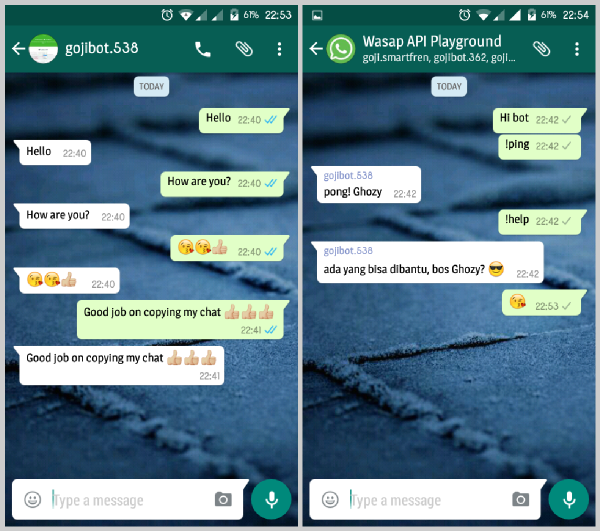

# wasapbot

> This project is abandoned and won't be maintained anymore, sorry.
---

Baca dalam [Bahasa Indonesia](README_ID.md).

A very simple WhatsApp bot script built using [Chat-API](https://github.com/WHAnonymous/Chat-API) library. This bot will send back any private message sent to it, and it also respond to "!ping" or "!help" sent to group.

Of course you can always add new feature or new function to this bot, this script is super simple, enough to give you a clue on how Chat-API works.



---

> This project is set up and tested on Ubuntu Linux system. If you're on other system or you can't find more detail on any particular information on this repo, you should always refer to [Chat-API](https://github.com/WHAnonymous/Chat-API).

---

### 1. Preparations & Setup

#### Install dependencies needed by Chat-API ([ref.](https://github.com/WHAnonymous/Chat-API/wiki/Dependencies))
Install dependencies using command:  
  
  ```
   sudo apt-get update
   sudo apt-get install ffmpeg openssl php5-cli php5-gd php5-curl php5-sqlite php5-mcrypt
  ```

**IMPORTANT!** WhatsApp now using encryption on its message, you need to install additional PHP extensions so the script can read encrypted messages. Please follow [this guide](https://github.com/WHAnonymous/Chat-API/issues/1180) on how to install them! **MUST!**

---

Make sure that all dependencies succesfully installed. Some things you need to check is:

- Check PHP version:  
` php -v `  
make sure the version is >= 5.6
```
 PHP 5.6.16-2+deb.sury.org~trusty+1 (cli) 
 Copyright (c) 1997-2015 The PHP Group
 ......
```

- Make sure all required extension is loaded  
` php -m `  
these 3 extensions must be present:  
```
..
curve25519
mcrypt
protobuf
..
```

If everything is OK, you can proceed to the next step.

#### Get WhatsApp password/token for your number

There ada some tools we can use to get WhatsApp password:

- Using CLI script provided by Chat-API [registerTool.php](https://github.com/mgp25/WhatsAPI-Official/blob/master/examples/registerTool.php)
- Using [WART](https://github.com/mgp25/WART) (for Windows)
- Using online tool http://watools.es/pwd.html made by Chat-API developer

Here we will use registerTool.php (you can always use other tool, their function is same, please refer to Chat-API).

1. Prepare any mobile number, it's advised to use a new number which has never been used on WhatsApp before, otherwise it may cause some problem. Make sure the number is able to receive sms or voice call to receive registration code from WhatsApp
2. Download this repo, then extract it
3. Go to [whatsapp/examples/](whatsapp/examples/) folder and run registerTool.php from your terminal or CLI:  
` cd whatsapp/examples/ `  
` php registerTool.php `
4. Input your bot's mobile number (country code prefixed, without plus sign '+')  
e.g. ` 6285xxxxxxxxx `
5. There will be option to choose verification method, 'sms' or 'voice', select one
6. Wait for the code
7. Input the code, in ` XXX-XXX ` format
8. We got the password!  
usually with this format: ` gojigejeB79ONvyUV87TtBIP8v7= `

If registration was unsuccessful, please examine the command's output then refer to [Chat-API Issues](https://github.com/WHAnonymous/Chat-API/issues) to find for the cause and how to deal with it.

### 2. Running The Bot

If you've got the password, then the next step is to run the [wasapbot.php](wasapbot.php) script.

1. Change the ` $username `, ` $password `, and ` $nickname ` according to your bot details.
2. Run via CLI:  
` php wasapbot.php `  
wait until it says 'BOT SIAP'.
3. Try to send message to the bot, the bot should send your message back to you. Success!

#### Troubleshooting

- Comment the ` error_reporting(....) ` (*row 19, wasapbot.php*) so PHP will display script error, check if there's an error.
- Change ` $debug ` variable into *true* so Chat-API will run in debug mode, check the debug output.

### 3. Change The Bot's Response

In this project, we only use 2 *event* as an example, ` onGetMessage(...) ` to get private message, and ` onGetGroupMessage(...) ` to get group message. You can change bot's response by editing the script inside those function. (*row 126 and 182, wasapbot.php*).

You can also add other *event* to add bot's capability, please refer to  [Chat-API Events](https://github.com/WHAnonymous/Chat-API/wiki/WhatsAPI-Documentation#list-of-all-events) for the list of available events.

### Contribute

* *Fork* and submit *Pull Request*
* Report *bug* and give any feedback on [Issues](issues)
* Contact me on Telegram: http://telegram.me/gojigeje
